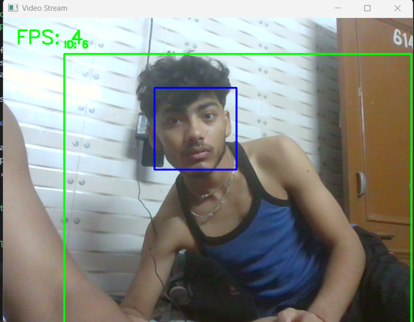
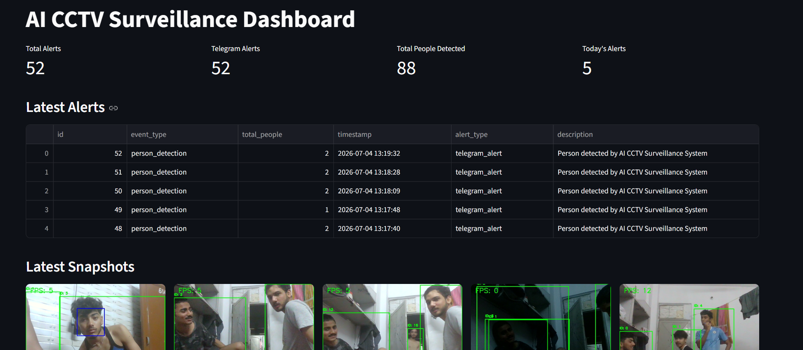
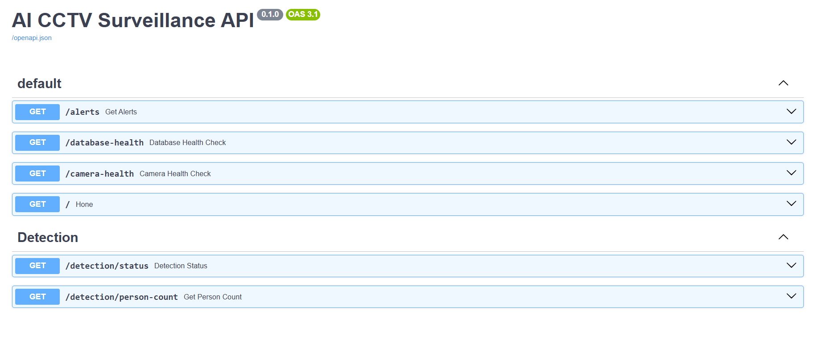
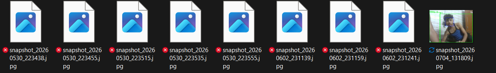

# AI CCTV Surveillance System

## Overview

AI CCTV Surveillance System is a real-time intelligent surveillance application designed to automate security monitoring using computer vision techniques. The system continuously processes live video streams to detect and track people, identify faces, generate instant alerts, save evidence snapshots, and maintain event logs for future analysis.

The application combines **YOLO-based person detection**, **OpenCV-based face detection**, **Telegram alert integration**, **SQLite database logging**, **FastAPI APIs**, and a **Streamlit dashboard** into a single modular system.

---

## Key Features

### Real-Time Person Detection

* Detects people from live CCTV/video streams using YOLO.
* Supports multiple person detection in a single frame.

### Face Detection

* Detects human faces using OpenCV Haar Cascade Classifier.
* Highlights detected faces with bounding boxes.

### Object Tracking

* Tracks detected individuals across frames.
* Maintains continuity of detected objects.

### Telegram Alerts

* Sends instant Telegram notifications when people are detected.
* Implements cooldown logic to avoid alert flooding.

### Snapshot Capture

* Automatically captures snapshots when alerts are triggered.
* Stores snapshots for evidence and future investigation.

### Database Logging

* Stores surveillance events in SQLite.
* Maintains records including:

  * Event type
  * Number of people detected
  * Timestamp
  * Alert type
  * Event description

### Streamlit Dashboard

Provides a monitoring dashboard displaying:

* Total Alerts
* Latest Alerts
* Snapshot Gallery
* Alert Statistics

### FastAPI Integration

Exposes REST APIs for:

* Alert retrieval
* System health checks
* Database monitoring
* Camera monitoring

### Automated Testing

Includes unit tests for:

* Database services
* Alert services
* API endpoints

---

## System Architecture

```text
Camera Feed
     │
     ▼
Video Stream Service
     │
     ▼
Person Detection (YOLO)
     │
     ▼
Face Detection
     │
     ▼
Object Tracking
     │
     ▼
Alert Service
 ┌─────────────┬─────────────┬─────────────┐
 │             │             │             │
 ▼             ▼             ▼             ▼
Telegram   Snapshot      Database      Dashboard
 Alert      Saving        Logging       Analytics
```

---

## Project Structure

```text
AI-CCTV-Surveillance-System/
│
├── app/
│   ├── api/
│   ├── core/
│   ├── dashboard/
│   ├── database/
│   ├── detection/
│   ├── models/
│   ├── services/
│   └── utils/
│
├── data/
│   ├── videos/
│   └── snapshots/
│
├── tests/
├── deployment/
├── notebooks/
├── logs/
│
├── requirements.txt
├── README.md
├── .env
├── setup.py
└── run.py
```

---

## Technology Stack

| Category             | Technologies     |
| -------------------- | ---------------- |
| Programming Language | Python           |
| Computer Vision      | OpenCV           |
| Object Detection     | YOLO             |
| Backend APIs         | FastAPI          |
| Dashboard            | Streamlit        |
| Database             | SQLite           |
| Notifications        | Telegram Bot API |
| Testing              | Pytest           |

---

## Installation

### Clone Repository

```bash
git clone <repository-url>
cd AI-CCTV-Surveillance-System
```

### Create Virtual Environment

```bash
python -m venv venv
```

### Activate Environment

** Windows

```bash
venv\Scripts\activate
```

** Linux/macOS

```bash
source venv/bin/activate
```

### Install Dependencies

```bash
pip install --upgrade pip
pip install -r requirements.txt
```

---

## Environment Variables

Create a `.env` file:

```env
DB_NAME=data/database.db

TELEGRAM_BOT_TOKEN=YOUR_BOT_TOKEN

TELEGRAM_CHAT_ID=YOUR_CHAT_ID

LOG_FILE=logs/app.log
```

---

## Running the Application

### Start Surveillance System

```bash
python run.py
```

### Start FastAPI Server

```bash
uvicorn app.api.main:app --reload
```

### Start Dashboard

```bash
python -m streamlit run app/dashboard/dashboard.py
```

---

## API Endpoints

| Method | Endpoint                  | Description           |
| ------ | ------------------------- | --------------------- |
| GET    | `/`                       | System status         |
| GET    | `/alerts`                 | Retrieve alerts       |
| GET    | `/health/database-health` | Database health check |
| GET    | `/health/camera-health`   | Camera health check   |

---

## Testing

Run automated tests using:

```bash
python -m pytest
```

Example output:

```text
==================== 3 passed ====================
```

---

## Current Capabilities

* Real-time person detection
* Face detection
* Person tracking
* Telegram alert system
* Snapshot generation
* SQLite event logging
* FastAPI integration
* Streamlit dashboard
* Automated testing

---

## 📸 Project Screenshots

### Person Detection



---

### Dashboard



---

### FastAPI Documentation



---

### Snapshot Gallery



## Future Improvements

* Suspicious activity detection
* Weapon detection
* Docker deployment
* Cloud deployment

---

## Author

Sachin Choudhary

---

## License

This project is developed for educational and portfolio purposes.
